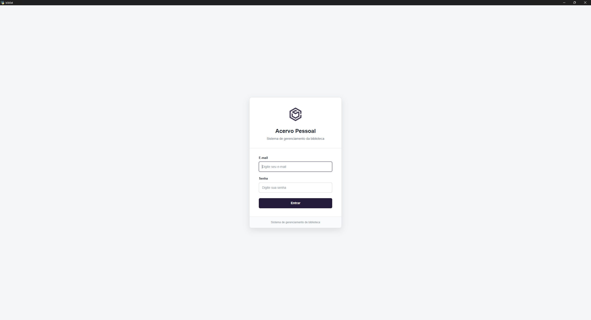
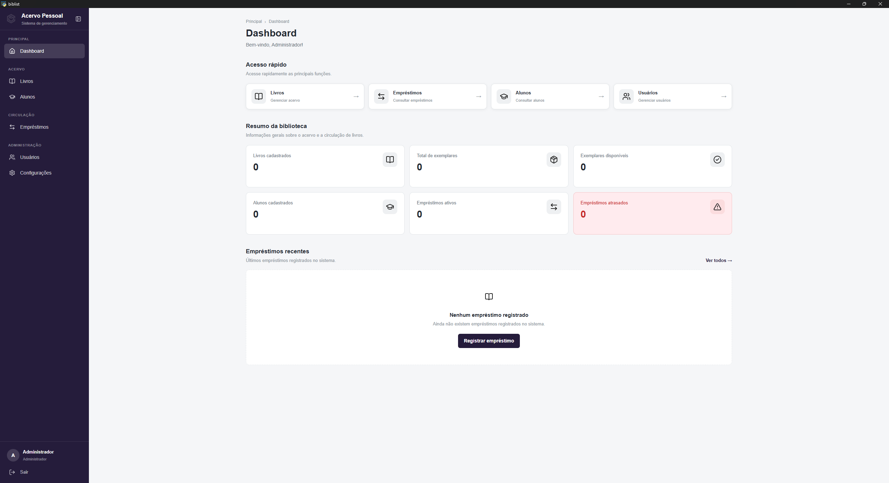
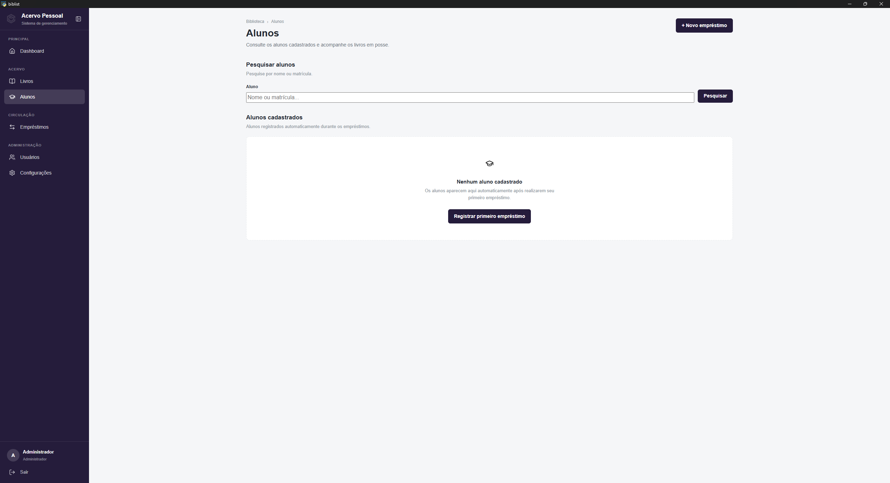
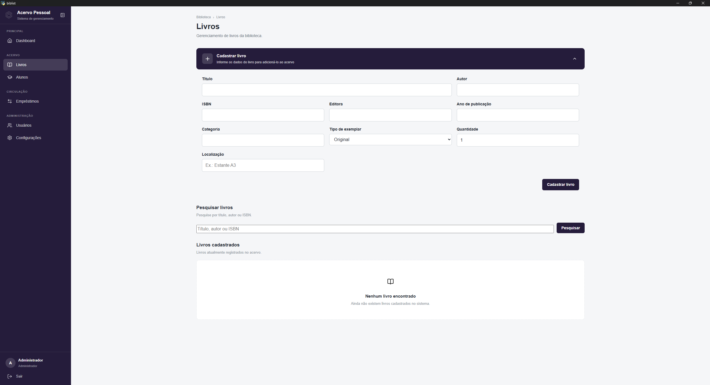
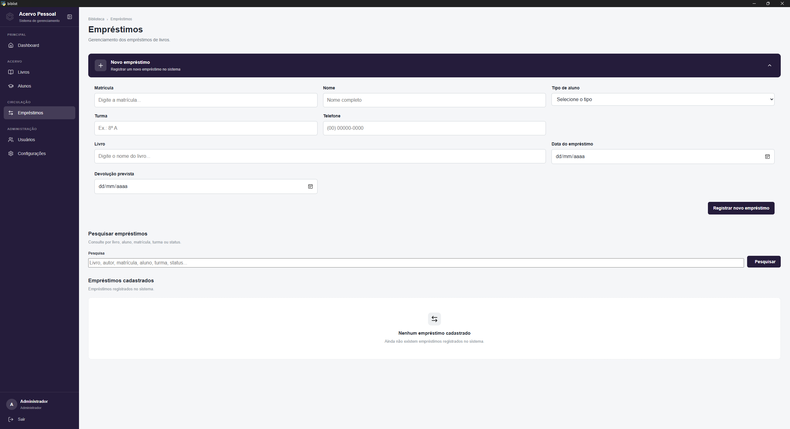
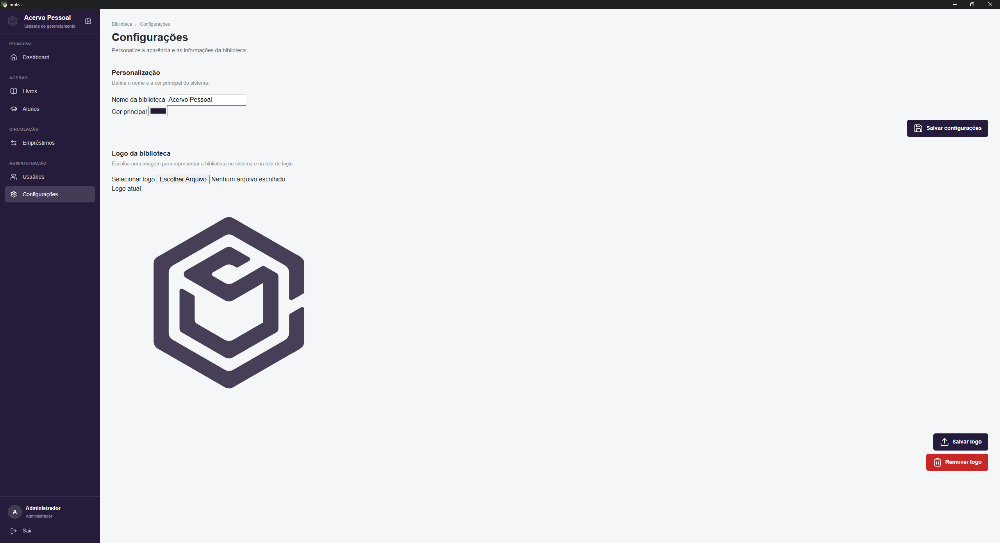

# Biblist (Biblioteca + System)

**Biblist** é um sistema desktop para gerenciamento de bibliotecas, desenvolvido em Python, com Flask como camada de aplicação e PyWebView para execução da interface em uma janela desktop.

O projeto foi desenvolvido com foco em organização de acervo, controle de usuários, empréstimos e devoluções, utilizando SQLite para persistência dos dados.

## Sobre o projeto

O Biblist permite centralizar as principais operações de uma biblioteca em uma única aplicação, desde o cadastro e organização dos livros até o controle de empréstimos e devoluções.

A aplicação utiliza uma arquitetura baseada em Flask, SQLAlchemy e Jinja2 para a camada de aplicação e interface, enquanto o PyWebView permite executar o sistema como uma aplicação desktop.

## Funcionalidades

### Acervo

* Cadastro de livros
* Edição e exclusão de livros
* Controle de quantidade disponível
* Registro de ISBN
* Autor e editora
* Ano de publicação
* Categoria
* Tipo de exemplar
* Localização do livro
* Validação de ISBN duplicado

### Empréstimos

* Registro de empréstimos
* Controle de devoluções
* Associação do empréstimo a um aluno
* Registro de matrícula, turma e telefone
* Data do empréstimo
* Data prevista para devolução
* Identificação automática de empréstimos atrasados
* Visualização dos detalhes do empréstimo
* Comprovante de empréstimo

### Usuários e acesso

* Sistema de autenticação
* Controle de acesso por perfil
* Usuários administradores
* Gerenciamento de usuários
* Alteração de senha
* Restrições de operações administrativas

### Configurações

* Personalização do nome da biblioteca
* Definição da cor principal da interface
* Upload de logotipo
* Personalização da identidade visual da aplicação

## Tecnologias

### Backend

* Python
* Flask
* Flask-Login
* Flask-SQLAlchemy
* SQLAlchemy
* Werkzeug

### Interface

* HTML5
* CSS3
* JavaScript
* Jinja2
* Lucide
* PyWebView

### Banco de dados

* SQLite

### Empacotamento

* PyInstaller

## Estrutura do projeto

```text
biblist/
├── assets/
│   └── livros.ico
│
├── database/
│   ├── database.py
│   └── models.py
│
├── static/
│   ├── css/
│   │   └── style.css
│   └── js/
│       └── lucide.js
│
├── templates/
│   ├── alterar_senha.html
│   ├── alunos.html
│   ├── base.html
│   ├── comprovante_emprestimo.html
│   ├── configuracoes.html
│   ├── detalhes_aluno.html
│   ├── detalhes_emprestimo.html
│   ├── detalhes_livro.html
│   ├── editar_aluno.html
│   ├── editar_livro.html
│   ├── editar_usuario.html
│   ├── emprestimos.html
│   ├── index.html
│   ├── livros.html
│   ├── login.html
│   └── usuarios.html
│
├── .gitignore
├── app.py
├── Biblist.spec
├── LICENSE
├── package.json
├── package-lock.json
└── requirements.txt
```

## Pré-requisitos

Para executar o projeto a partir do código-fonte, é necessário ter instalado:

* Python 3.12 ou compatível
* Node.js e npm
* Git

O Node.js é utilizado para o gerenciamento da dependência JavaScript do projeto.

## Instalação

Clone o repositório:

```bash
git clone https://github.com/lucasferne/biblist.git
```

Entre no diretório:

```bash
cd biblist
```

Crie um ambiente virtual:

```bash
python -m venv .venv
```

Ative o ambiente virtual no Windows:

```powershell
.venv\Scripts\Activate.ps1
```

Instale as dependências Python:

```bash
pip install -r requirements.txt
```

Instale as dependências JavaScript:

```bash
npm install
```

Execute a aplicação:

```bash
python app.py
```

## Executando como aplicação desktop

O Biblist utiliza o PyWebView para apresentar a aplicação em uma janela desktop.

Ao executar o `app.py`, a aplicação Flask é inicializada e sua interface é apresentada através do PyWebView.

## Banco de dados

O Biblist utiliza **SQLite** como banco de dados.

Os dados da aplicação são armazenados localmente, permitindo que o sistema seja utilizado sem a necessidade de configurar um servidor de banco de dados externo.

## Geração do executável

O projeto possui um arquivo de especificação do PyInstaller:

```text
Biblist.spec
```

A partir dele, o executável pode ser gerado com:

```powershell
pyinstaller Biblist.spec
```

O executável gerado será disponibilizado na pasta:

```text
dist/Biblist/
```

O instalador do Biblist é distribuído separadamente através das releases do projeto.

## Screenshots

### Login



### Dashboard



### Alunos



### Cadastro de livros



### Cadastro de empréstimos



### Customização




## Licença

Este projeto está disponível sob a licença definida no arquivo [`LICENSE`](LICENSE).
